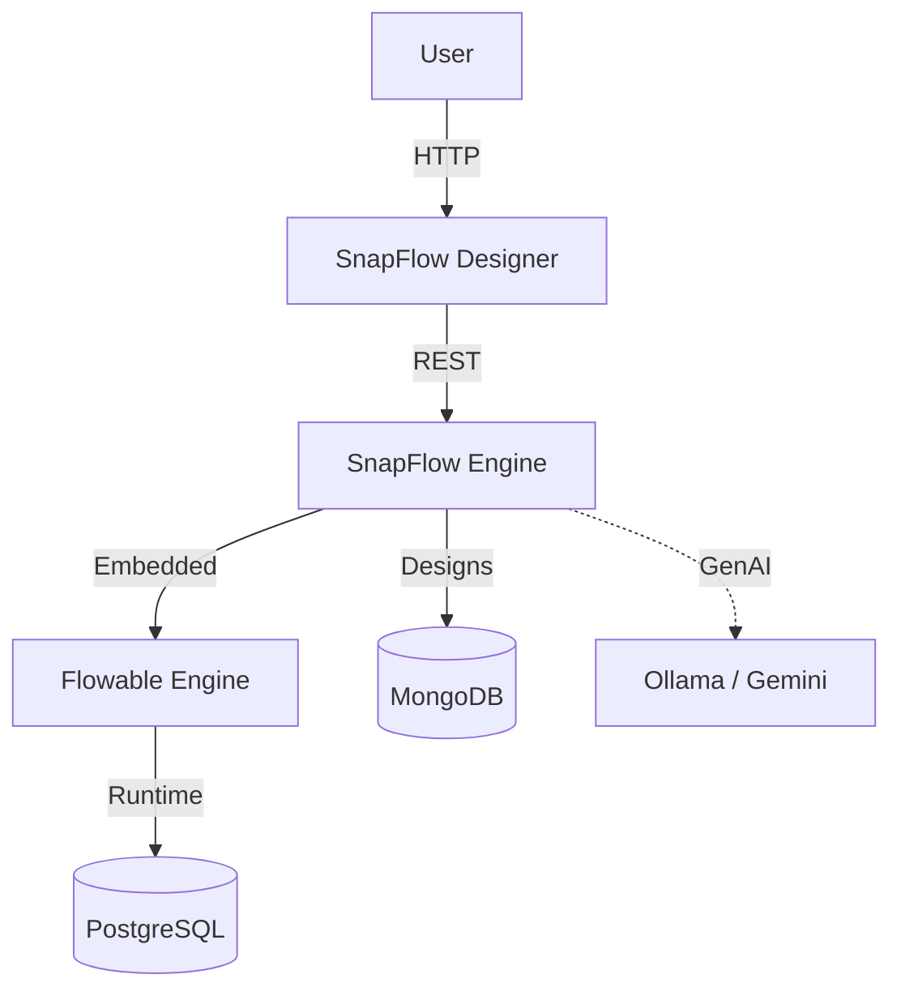

# SnapFlow 🚀

SnapFlow is an enterprise-grade AI-powered workflow automation platform, built to rival Pega and Camunda. 
It combines a visual **Workflow Designer**, a powerful **Forms Engine**, and a **Rules Engine** into one cohesive platform.


## 🌟 Key Features

- **Visual Workflow Designer**: Drag-and-drop BPMN 2.0 compliant editor.
- **Smart Versioning**: Auto-increment versions (v1, v2) with safe backups.
- **Form Designer**: Build complex forms with validations and logic.
- **Collaboration**: Real-time @mentions and threaded comments on any node.
- **AI Integration**: (Coming Soon) Text-to-Workflow and Text-to-Form generation.
- **Enterprise Engine**: Process execution powered by Flowable & Spring Boot.

## 🏗️ Architecture



- **Frontend**: Next.js 14, TailwindCSS, ReactFlow (SnapFlow Designer)
- **Backend**: Spring Boot 3.2, Flowable Engine (SnapFlow Engine)
- **Database**: PostgreSQL (Process Engine), MongoDB (Design Repository)
- **Auth**: Keycloak (Optional) or Simple Mock Auth

## 🚀 Getting Started

### Prerequisites
- Docker & Docker Compose
- Java 17+
- Node.js 18+

### 🐳 Docker Configuration
**Note:** This repository uses a single root `docker-compose.yml`. Previous separate database configurations have been consolidated.

### Quick Start (Development)

1. **Spin up Infrastructure (DBs)**
   ```bash
   docker-compose up -d postgres mongodb
   ```

2. **Start Backend (Engine)**
   ```bash
   cd snapflow-engine
   ./gradlew bootRun
   ```
   *Server runs on http://localhost:8081*

3. **Start Frontend (Designer)**
   ```bash
   cd snapflow-designer
   npm install
   npm run dev
   ```
   *Designer runs on http://localhost:3000*

### Full Stack Docker Run
To run everything (including apps) in Docker:
```bash
docker-compose up --build
```

## 🤝 Collaboration Features
SnapFlow allows teams to collaborate directly on the canvas:
- Open the **Collaboration Panel** on any workflow.
- Type `@username` to notify team members.
- Use the **Notification Bell** to jump to mentions.

## 🧪 Testing Credentials
- **Login**: No login required in Dev mode (Mock User active)
- **DB Admin**: access via standard ports

## License
Proprietary / Closed Source
